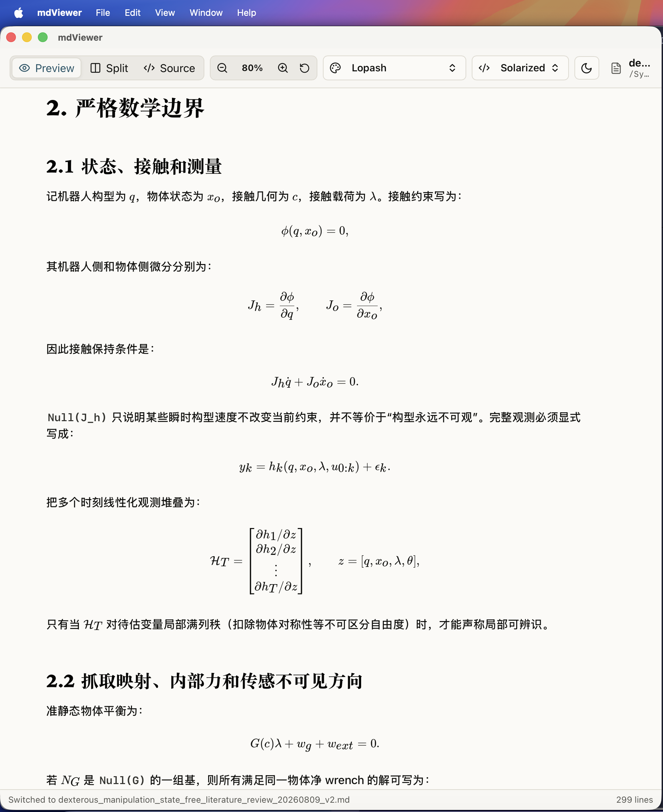

# mdViewer

A lightweight macOS Markdown reader and editor built with Tauri v2, React,
TypeScript, and Rust. It opens a file, shows it properly, and lets you change
it — no sync, no account, no note library. Your files stay where you put them.

<p align="center">
  
</p>

## Features

### LaTeX math

Formulas render through [KaTeX](https://katex.org/), and **both delimiter styles
work**:

| Style | Inline | Display |
| --- | --- | --- |
| Dollar | `$E = mc^2$` | `$$ ... $$` |
| LaTeX-native | `\(E = mc^2\)` | `\[ ... \]` |

The second row matters in practice: notes exported from LaTeX documents and from
LLM chats overwhelmingly use `\(` and `\[`, which many Markdown readers show as
raw backslashes.

Details worth knowing:

- **KaTeX fonts ship inside the app.** Rendering is fully offline; no TeX
  installation is needed.
- **Prices stay prices.** `$100 and $200` is left as text rather than being
  swallowed into a formula, following the same rule Pandoc uses — real inline
  math never has whitespace hugging its delimiters.
- **Code is never touched.** `\(x\)` inside a fenced block or an inline code
  span renders verbatim, so documents *about* LaTeX still read correctly.
- **A broken formula stays local.** Malformed input shows up in red in place
  instead of taking the page down with it.
- **Wide formulas scroll** inside their own block rather than stretching the
  page.

Open `sample-math.md` to see all of the above at once.

### Reading

- Opens `.md`, `.markdown`, `.mdown`, `.mkd`, and `.txt`.
- GitHub Flavored Markdown: tables, task lists, fenced code blocks with syntax
  highlighting.
- Renders images, including relative paths resolved against the opened file's
  own directory.
- Tabs, with drag-and-drop to open files.
- Recent files, both in the empty-state list and under `File > Open Recent`.
  Entries that no longer resolve are dropped automatically.
- Preview-only by default; editor-only and split editor/preview also available.
- Switchable reading themes and syntax-highlight themes.
- Zoom the reading area without resizing the toolbar.
- Light/dark theme toggle.

## Editing

`Command+N` opens an empty document; `Command+2` puts the editor beside the
preview and `Command+3` gives it the whole window. Both use CodeMirror, with Markdown highlighting and the same five
palettes the preview's code blocks use, so the editor is not a sixth colour
scheme that agrees with none of the others.

Typing updates the document immediately and the preview follows a fifth of a
second later. Relaying every formula in a file on each keystroke is the
expensive half, and waiting for a pause is what keeps typing from stuttering.

A new document has no file behind it until you save: asking where to put it
first would interrupt the thought that prompted `Command+N`, so the location is
chosen at the first `Command+S`.

**Saving is explicit.** `Command+S` writes the file; until then a dot marks the
tab and the status bar says so, and closing a tab, reloading, or quitting asks
before discarding anything. Notes can autosave because it owns its storage and
its history — mdViewer edits the real file in your Finder, quite possibly inside
a synced folder, where every stray keystroke would propagate immediately.

The write itself goes to a temporary file and is renamed over the original,
which is atomic within a filesystem: an interruption leaves the previous version
intact rather than half a document.

## Shortcuts

| Key | Action |
| --- | --- |
| `Command+N` | New document |
| `Command+O` | Open a file |
| `Command+S` | Save |
| `Command+R` | Reload the current file |
| `Command+W` | Close the current tab |
| `Command+1` | Preview only |
| `Command+2` | Split editor/preview |
| `Command+3` | Editor only |
| `Command+=` | Zoom in |
| `Command+-` | Zoom out |
| `Command+0` | Reset zoom |
| `Command+T` | Cycle Markdown reading theme |
| `Command+D` | Toggle light/dark theme |

## Develop

Requires [Node.js](https://nodejs.org/), [Rust](https://www.rust-lang.org/), and
the Xcode command line tools.

```sh
npm install           # install dependencies
npm run tauri dev     # run the desktop app
npm run build         # build the frontend
npm run tauri build   # build the desktop app
```

Check the Rust side:

```sh
cd src-tauri && cargo check
```

## Samples

- `sample.md` — tables, task lists, code blocks, and a relative local image.
- `sample-math.md` — every math case above, including the ones that must *not*
  render as math.
- `sample-mermaid.md` — flowchart, sequence, and state diagrams, plus a broken
  one to show what failure looks like.

## In the terminal instead

[**mdTerminal**](https://github.com/horychen/mdTerminal) is the sibling of this
project: the same documents — maths, images, and Mermaid diagrams all rendered
— read in a terminal rather than a window.

```sh
npm i -g @horychen/mdterminal
mdterm notes.md
```

It needs a terminal that speaks the Kitty graphics protocol (Ghostty, Kitty,
WezTerm). The two share their trickiest piece of logic: the rule that rewrites
`\(...\)` before parsing, and the guard that keeps `$100 and $200` from being
read as a formula.

## License

MIT
