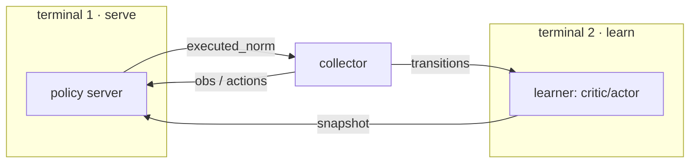
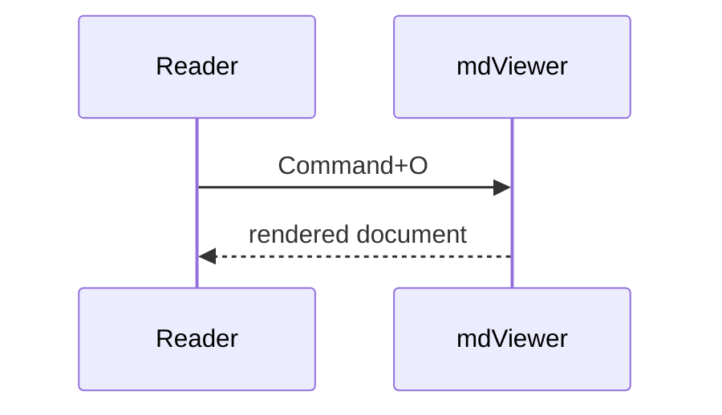
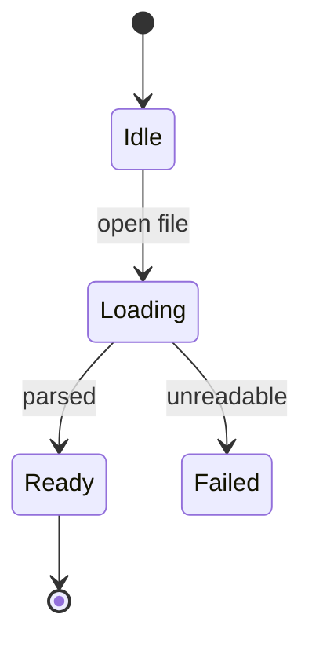

# Mermaid rendering check

## Flowchart with subgraphs



## Sequence



## State



## A deliberately broken diagram

The rest of the page must still render, and the source should stay visible.

```mermaid
flowchart LR
  A --> --> B[[[
```

## Ordinary code must not be touched

```js
const diagram = "flowchart LR";
```

Text after everything still renders.
